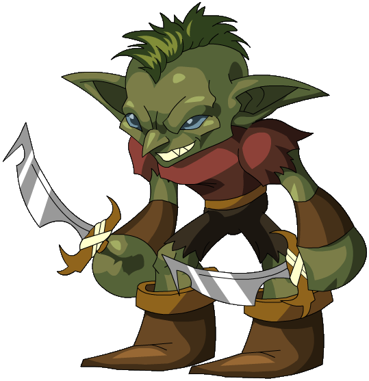

## Dungeon master notities

### Bezittingen
* Schorpioen angel
* 1 [Dust of Dryness]({{ site.baseurl }}) snufje

### Algemeen
* Kan 1 potion per dag maken, als de spelers hier de dag van tevoren om vragen en als hij de [Lab Coat (worn)]({{ site.baseurl }}) aan heeft

### Statblock

**Potion Slinging Table**

Resultaat (D20) | Potion
---     |---
1-4     | [Potion of Healing](https://www.dndbeyond.com/magic-items/4708-potion-of-healing)
5-8     | [Oil of Slipperiness](https://www.dndbeyond.com/magic-items/4689-oil-of-slipperiness)
9 - 12  | [Potion of Hill Giant Strength](https://www.dndbeyond.com/magic-items/4706-potion-of-hill-giant-strength)
13 - 16 | [Potion of Poison](https://www.dndbeyond.com/magic-items/4712-potion-of-poison)
17 - 20 | [Potion of Water Breathing](https://www.dndbeyond.com/magic-items/4715-potion-of-water-breathing)

---

## Algemeen
* Volledige naam: Albert Tweesteen
* Bijnamen: -
* Ras: Goblin
* Geslacht: Man
* Leeftijd: 20
* Woonplaats: Surewould-bos
* Bevindt zich op dit moment in: Op avontuur met een groep avonturiers
* Talen: Common, Goblin

## Beroep en geschiedenis
Heeft ooit een labjas gevonden en aangetrokken. De andere Goblins dachten hierdoor dat hij slim was dus heeft hij het beroep van wetenschapper aangenomen.

## Uiterlijk
Typische Goblin. Klein, groen, vies. Heeft normaal gesproken een oude, vieze, kapotte labjas aan.

## Capaciteiten
Hij denkt dat hij heel slim is, maar is dit helemaal niet.

## Talenten
Kan op miraculeuze wijze potions brouwen zonder dat hij weet wat hij doet.

## Hebbelijkheden
Is heel zelfverzekerd. Hij denkt schijnbaar echt dat hij een slimme wetenschapper is.

## Interactie met anderen
Voelt zich heel slim, dus kijkt een beetje op anderen neer. Koning Splurt behandelt hij wel met respect, aangezien hij groter en sterker is dan Albert.

## Idealen
Hebzucht en trots.

## Bonden
Wil altijd de slimste persoon in de kamer zijn (of denken dat hij dat is).

## Gebreken of fouten
Is heel afhankelijk van zijn labjas, deze geeft hem namelijk veel zelfverzekerdheid.

---

## Komt voor in
* [De Redding van (Prinses) Azura]({{ site.baseurl }})
* [De Legende van Kapitein Groenbaard]({{ site.baseurl }})

## Gerelateerde karakters
* [Koning Splurt]({{ site.baseurl }})
* [Nettie Bettie]({{ site.baseurl }})

## Gerelateerde locaties
* [Goblin Schuilplaats]({{ site.baseurl }})

## Items

### Huidige bezittingen
* [Dust of Dryness]({{ site.baseurl }}) (1 snufje)

### Vorige bezittingen
* [Lab Coat (worn)]({{ site.baseurl }})
* [Staff of Average Intelligence]({{ site.baseurl }})

## Galerij

