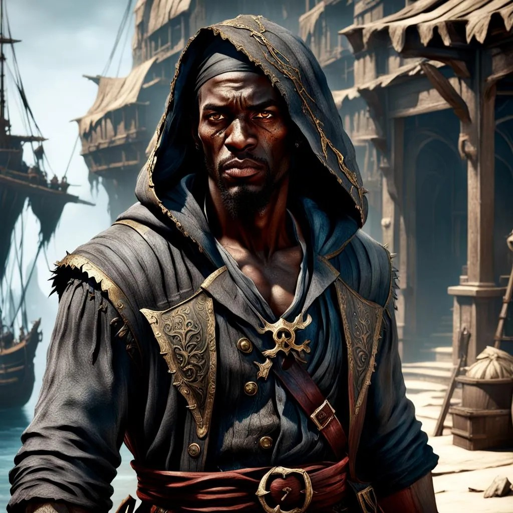

## Algemeen
* Volledige naam: Onbekend
* Bijnamen: Arikikuchiariku
* Ras: Mens
* Geslacht: Man
* Leeftijd: 27
* Woonplaats: Onbekend
* Bevindt zich op dit moment in: Een gestolen luchtschip riching Phandalin
* Talen: Common, Sylvan, Primordial

## Beroep en geschiedenis
Heeft nauw met Kapitein Groenbaard samengewerkt als piraat. Tegenwoordig ranger en avonturier, maar is zijn piratenleven nog niet vergeten.

## Uiterlijk
Ongeveer 180 cm en 85 kg. Zwarte huid, blauwe ogen, en kort, zwart haar.

## Capaciteiten
Behandig en verstandig.

## Talenten
Kan luchtschepen besturen.

## Hebbelijkheden
Onbekend.

## Interactie met anderen
Onbekend.

## Idealen
Onbekend.

## Bonden
Onbekend.

## Gebreken of fouten
Onbekend.

---

## Komt voor in
* [The Rescue of (Princess) Azura]({{ site.baseurl }})
* [Recruiting Twilly]({{ site.baseurl }})
* [Captain Greenbeard's Legend]({{ site.baseurl }})

## Gerelateerde karakters
* [Adonis]({{ site.baseurl }})
* [Kapitein Groenbaard]({{ site.baseurl }})
* [Laranlor Cormearil]({{ site.baseurl }})
* Lushikukukanda
* P.E.K.K.A.
* Theodas
* [Twilly]({{ site.baseurl }})

## Gerelateerde locaties
* -

## Items
* [Circlet of Enlarge Reduce]({{ site.baseurl }})

## Galerij
