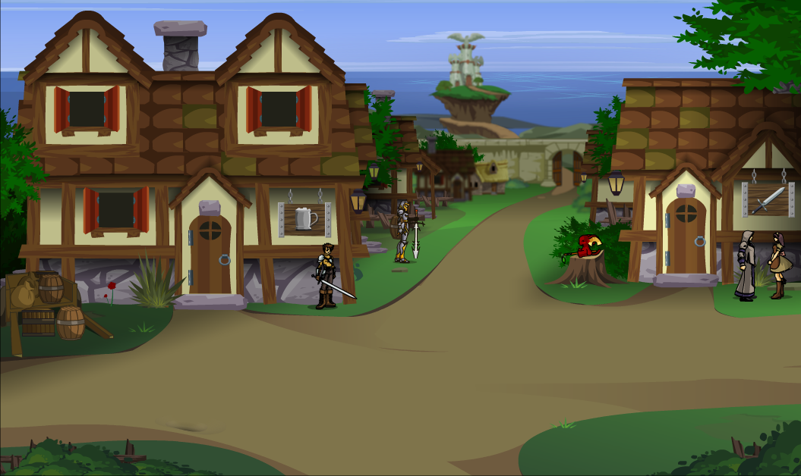

## Algemeen
* Volledige naam: Ash Dragonblade
* Bijnamen: -
* Ras: Mens
* Geslacht: Man
* Leeftijd: 14
* Woonplaats: Falconreach
* Bevindt zich op dit moment in: Falconreach
* Talen: Common

## Beroep en geschiedenis
Wil later avonturier worden.

## Uiterlijk
Heeft een zwaard van Yulgar gekregen, en heeft zelf metalen platen als harnas gemaakt.

## Capaciteiten
Vastberaden en hoopvol.

## Talenten
Kan aardig met een zwaard omgaan voor zijn leeftijd.

## Hebbelijkheden
Loopt vaak te ijsberen.

## Interactie met anderen
Is verlegen rond vreemdelingen. Heeft een goede vriendschap met Azura Zingzwaard.

## Idealen
Eer en algemeen belang.

## Bonden
Is bereid om veel te doen voor het algemeen belang.

## Gebreken of fouten
Onervaren, kan zijn eigen krachten niet goed inschatten.

---

## Komt voor in
* [The Rescue of (Princess) Azura]({{ site.baseurl }})

## Gerelateerde karakters
* [Azura Zingzwaard]({{ site.baseurl }})

## Gerelateerde locaties
* [Falconreach]({{ site.baseurl }})

## Items

### Huidige bezittingen
* -

### Vorige bezittingen
* -

## Galerij

