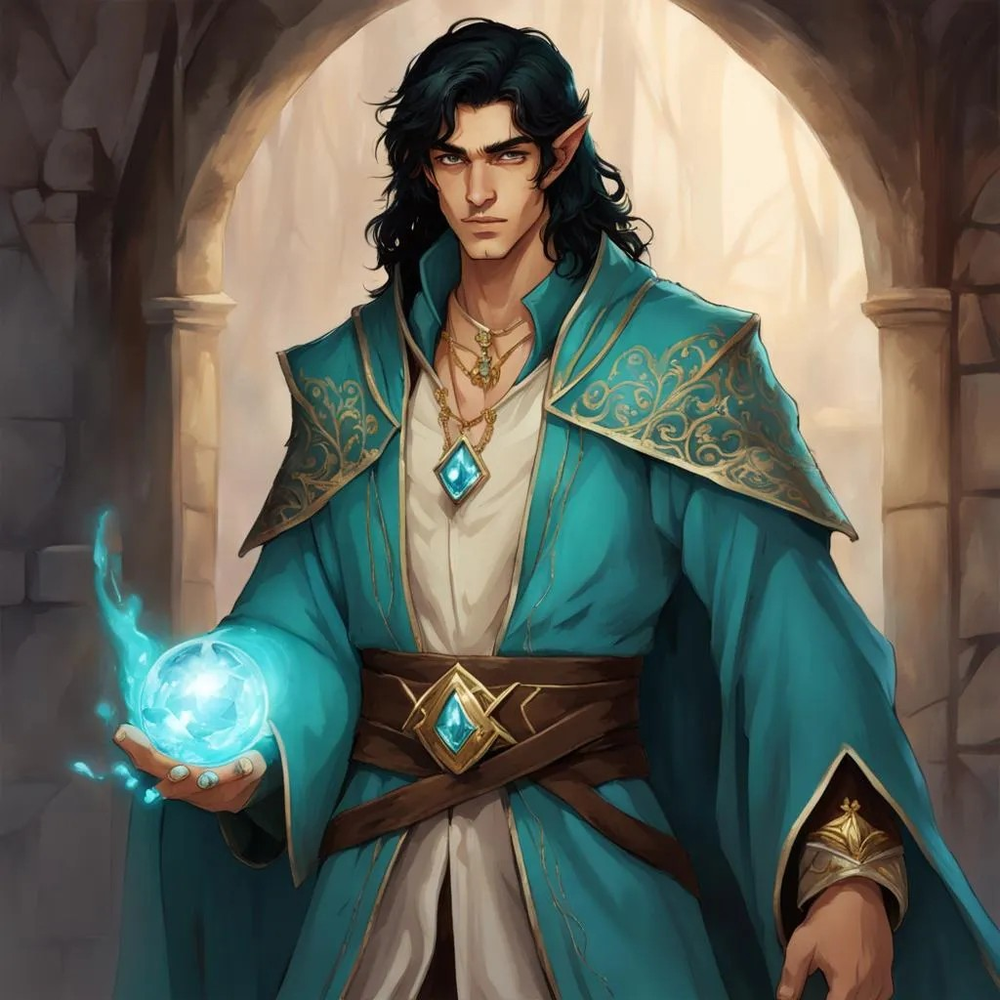

## Algemeen
* Volledige naam: Laranlor Cormearil
* Bijnamen: Lan
* Ras: Half-Elf
* Geslacht: Man
* Leeftijd: Onbekend
* Woonplaats: Onbekend
* Bevindt zich op dit moment in: Een gestolen luchtschip richting Phandalin
* Talen: Common, Elvish, Primordial, Draconic

## Beroep en geschiedenis
Wettelijke prins van een land. Uit het land verbannen door zijn ouders. Nu op de vlucht leert hij steeds meer van zijn magische aard, en traint hij zichzelf om de magie in hem in bedwang te houden.

## Uiterlijk
Als adel gekleed. Lijkt altijd schoon te zijn en lekker te ruiken.

## Capaciteiten
Zeer charismatisch.

## Talenten
Onbekend.

## Hebbelijkheden
Voert vaak de spreuk prestidigitation uit op zichzelf om aantrekkelijker over te komen.

## Interactie met anderen
Onbekend.

## Idealen
Onbekend.

## Bonden
Onbekend.

## Gebreken of fouten
Onbekend.

---

## Komt voor in
* [The Rescue of (Princess) Azura]({{ site.baseurl }})
* [Captain Greenbeard's Legend]({{ site.baseurl }})

## Gerelateerde karakters
* [Adonis]({{ site.baseurl }})
* [Arikikuchiariku]({{ site.baseurl }})
* [Lushikukukanda]({{ site.baseurl }})
* [P.E.K.K.A.]({{ site.baseurl }})
* [Theodas]({{ site.baseurl }})

## Gerelateerde locaties
* -

## Items

### Huidige bezittingen
* [Dust of Dryness]({{ site.baseurl }}) (4 snufjes)

### Vorige bezittingen
* [Dust of Dryness]({{ site.baseurl }}) (1 snufje)

## Galerij
