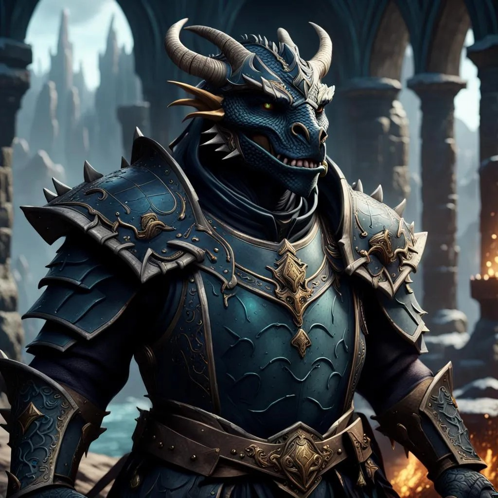

## Algemeen
* Volledige naam: Onbekend
* Bijnamen: Lushikukukanda, Kuku
* Ras: Dragonborn
* Geslacht: Man
* Leeftijd: 24
* Woonplaats: Onbekend
* Bevindt zich op dit moment in: Een gestolen luchtschip riching Phandalin
* Talen: Common, Draconic

## Beroep en geschiedenis
Deze volksheld kwam in opstand tegen de agenten van een tiran van de cashewindustrie in Wakanda. Hij heeft later besloten om als cleric het avonturenleven aan te gaan om mogelijk zijn familie te kunnen vinden.

## Uiterlijk
Ongeveer 190 cm en 220 kg. Zwarte huid, blauwe ogen, en geen haar.

## Capaciteiten
Wijs en intelligent.

## Talenten
Kan goed omgaan met land voertuigen.

## Hebbelijkheden
Sterk gevoel voor eerlijkheid. Vindt vaak eerlijke oplossingen voor argumenten.

## Interactie met anderen
Onbekend.

## Idealen
Eerlijkheid.

## Bonden
Familie.

## Gebreken of fouten
Heeft een zwak voor de ondeugden van de stad, vooral voor sterke drank.

---

## Komt voor in
* [The Rescue of (Princess) Azura]({{ site.baseurl }})
* [Captain Greenbeard's Legend]({{ site.baseurl }})

## Gerelateerde karakters
* [Adonis]({{ site.baseurl }})
* [Arikikuchiariku]({{ site.baseurl }})
* [Laranlor Cormearil]({{ site.baseurl }})
* [P.E.K.K.A.]({{ site.baseurl }})
* [Theodas]({{ site.baseurl }})

## Gerelateerde locaties
* -

## Items
* [Lab Coat (worn)]({{ site.baseurl }})

## Galerij
