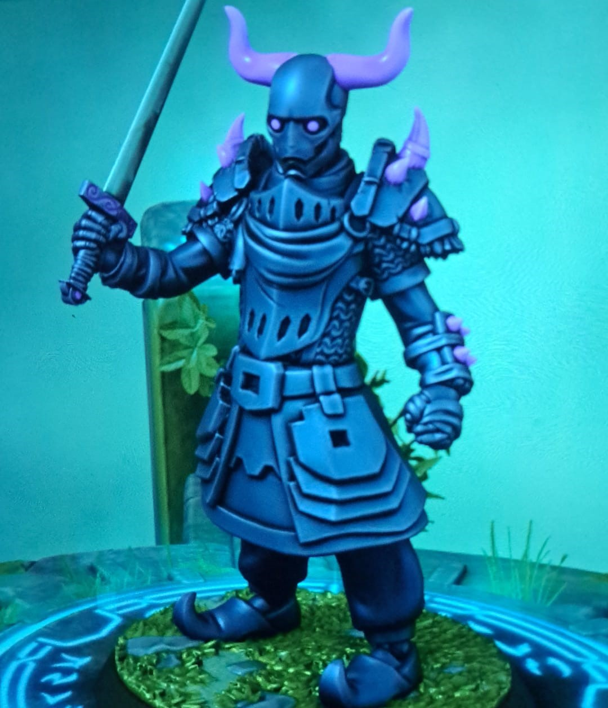

## Algemeen
* Volledige naam: Onbekend
* Bijnamen: P.E.K.K.A.
* Ras: Warforged
* Geslacht: Man
* Leeftijd: Onbekend
* Woonplaats: Onbekend
* Bevindt zich op dit moment in: Een gestolen luchtschip richting Phandalin
* Talen: Onbekend

## Beroep en geschiedenis
Als Warforged is P.E.K.K.A. gemaakt voor oorlog, maar aangezien de oorlog in Eberron voorbij is, leeft P.E.K.K.A. zijn eigen leven. Hij heeft besloten om zijn krachten in te zetten voor avontuur.

## Uiterlijk
Een enorm lopen blauw en paars harnas.

## Capaciteiten
Zeer sterk.

## Talenten
Onbekend.

## Hebbelijkheden
Wordt snel afgeleid door vlinders.

## Interactie met anderen
Onbekend.

## Idealen
Onbekend.

## Bonden
Onbekend.

## Gebreken of fouten
Onbekend.

---

## Komt voor in
* [De Redding van (Prinses) Azura]({{ site.baseurl }})
* [Twilly Rekruteren]({{ site.baseurl }})
* [Captain Greenbeard's Legend]({{ site.baseurl }})

## Gerelateerde karakters
* [Adonis]({{ site.baseurl }})
* [Arikikuchiariku]({{ site.baseurl }})
* [Laranlor Cormearil]({{ site.baseurl }})
* [Lushikukukanda]({{ site.baseurl }})
* [Theodas]({{ site.baseurl }})

## Gerelateerde locaties
* -

## Items

### Huidige bezittingen
* -

### Vorige bezittingen
* [Staff of Average Intelligence]({{ site.baseurl }})

## Galerij
