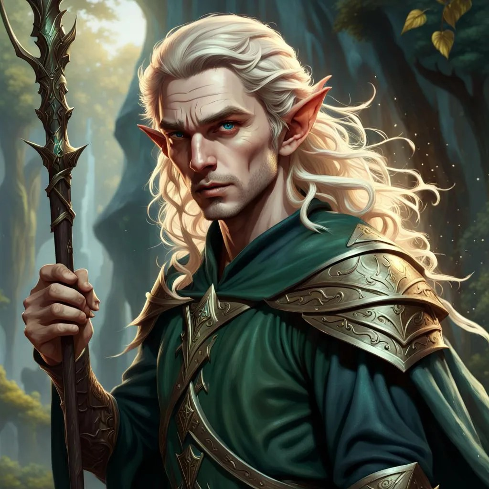

## Algemeen
* Volledige naam: Onbekend
* Bijnamen: Theodas
* Ras: High-Elf
* Geslacht: Man
* Leeftijd: 100
* Woonplaats: Onbekend
* Bevindt zich op dit moment in: Een gestolen luchtschip richting Phandalin
* Talen: Common, Elvish, Undercommon

## Beroep en geschiedenis
Als buitenstaander leefde hij met een nauwe groep Elven, totdat het dorpje waar hij woonde aan werd gevallen. Theodas is de enige die de aanval heeft overleefd, en zoekt nu manieren om de moordenaars te berechten.

## Uiterlijk
Ongeveer 165 cm lang.

## Capaciteiten
Charismatisch en bevorderd in magie.

## Talenten
Onbekend.

## Hebbelijkheden
Onbekend.

## Interactie met anderen
Onbekend.

## Idealen
Onbekend.

## Bonden
Onbekend.

## Gebreken of fouten
Onbekend.

---

## Komt voor in
* [De Redding van (Prinses) Azura]({{ site.baseurl }})
* [De Legende van Kapitein Groenbaard]({{ site.baseurl }})

## Gerelateerde karakters
* [Adonis]({{ site.baseurl }})
* [Arikikuchiariku]({{ site.baseurl }})
* [Laranlor Cormearil]({{ site.baseurl }})
* [Lushikukukanda]({{ site.baseurl }})
* [P.E.K.K.A.]({{ site.baseurl }})

## Gerelateerde locaties
* -

## Items

### Huidige bezittingen
* [Wind Fan]({{ site.baseurl }})

### Vorige bezittingen
* -

## Galerij
 