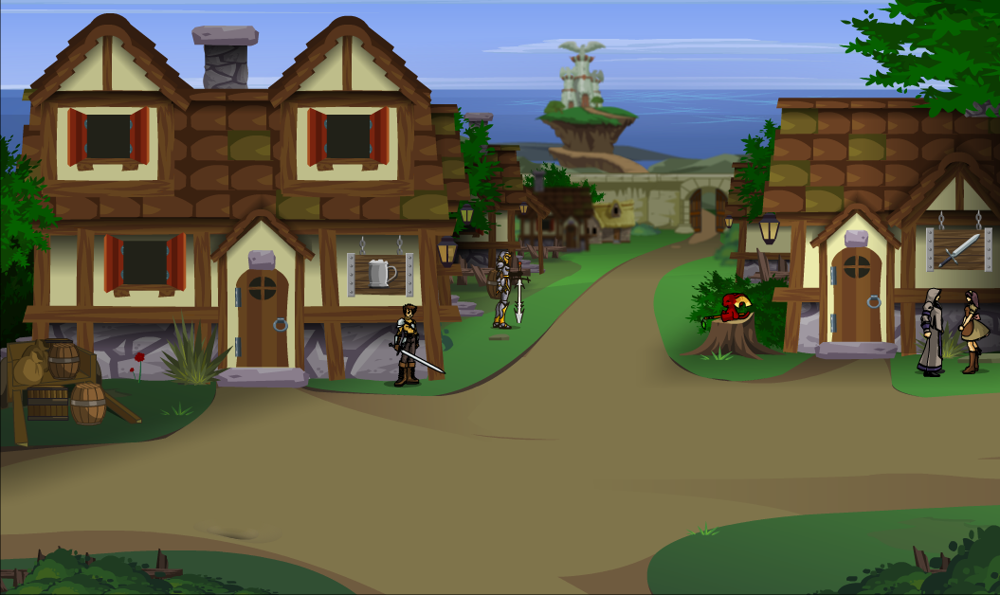

## Dungeon master notities

### Statblock

---

## Algemeen
* Volledige naam: Twilly
* Bijnamen: Held van Falconreach
* Ras: Onbekend
* Geslacht: Man
* Leeftijd: 5
* Woonplaats: Falconreach
* Bevindt zich op dit moment in: Op avontuur met een groep avonturiers
* Talen: Begrijpt Common en Goblin, spreekt één woord Common ("Hallo!")

## Beroep en geschiedenis
Samen met Robina the Hood beschermer van het SureWould-bos.

## Uiterlijk
Een klein, rood beestje met gele oren.

## Capaciteiten
Wijs en behendig, maar niet sterk. Het stokje dat hij bij zich heeft, heeft helende krachten.

## Talenten
Kan snel voor gevaar uit de weg duiken. Ontzettend dapper voor zijn maat.

## Hebbelijkheden
Zegt niet veel.

## Interactie met anderen
Vriendelijk, altijd bereid om iemand te groeten.

## Idealen
Vrijheid.

## Bonden
Wil op avontuur om de wereld te verkennen.

## Gebreken of fouten
Spreekt bijna geen talen en is naïef.

---

## Komt voor in
* [De Redding van (Prinses) Azura]({{ site.baseurl }})
* [Twilly Rekruteren]({{ site.baseurl }})
* [De Legende van Kapitein Groenbaard]({{ site.baseurl }})

## Gerelateerde karakters
* [Arikikuchiariku]({{ site.baseurl }})
* [Robina the Hood]({{ site.baseurl }})

## Gerelateerde locaties
* [Falconreach]({{ site.baseurl }})
* [Surewould-bos]({{ site.baseurl }})

## Items

### Huidige bezittingen
* -

### Vorige bezittingen
* -

## Galerij

