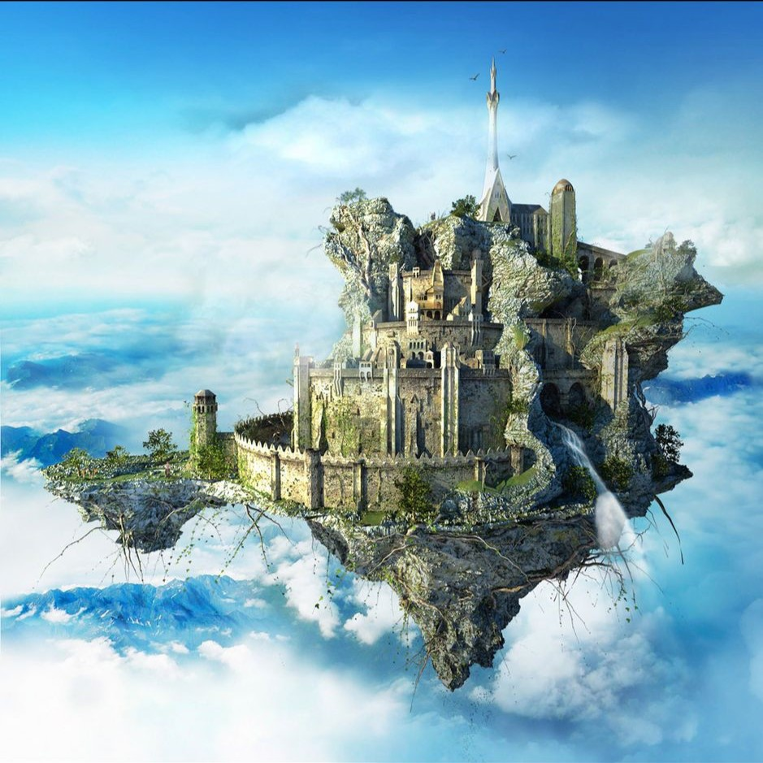

## Algemeen
* Soort: Zwevend eiland
* Inwoners: Bewakers, gevangenen
* Populatie: Onbekend, afhankelijk van de hoeveelheid gevangenen en bemanning
* Geografische locatie: Boven het land van Greenguard, bewegend tussen verschillende locaties
* Infrastructuur: Een hoog beveiligde gevangenis, luchtvervoer-dokken voor vliegende voertuigen
* Politiek: Het eiland valt onder de jurisdictie van Greenguard en dient als mobiel gevangeniseiland
* Geschiedenis: Drakengreep heeft een lange geschiedenis als gevangenis en wordt al eeuwen gebruikt om gevaarlijke criminelen op te sluiten
* Cultuur: De bewoners van het eiland, voornamelijk bewakers en gevangenen, hebben een cultuur van discipline, een strikt regime en omgaan met de uitdagingen van hun isolatie

## Overzicht
Drakengreep is een zwevend eiland boven het land van Greenguard. Het eiland is een imposante locatie, met een centrale gevangenis die gevaarlijke criminelen opsluit. Drakengreep beweegt tussen verschillende locaties, waardoor het moeilijk te traceren is.

## Gevangenis
De gevangenis bevindt zich centraal op Drakengreep en wordt omringd door dikke muren en steile kliffen. Het is een donkere en imponerende structuur met zware beveiliging, waaronder magische barrières, vallen en bewakers. De cellen zijn goed beveiligd en het complex wordt voortdurend bewaakt.

## Haven
Drakengreep beschikt over een haven met dokken voor luchtvervoer, geschikt voor het aanmeren van vliegende schepen. Deze dokken zijn essentieel voor het transport van gevangenen en goederen, en worden bewaakt door bewakers om ongeautoriseerde toegang te voorkomen.

---

## Komt voor in
* [Captain Greenbeard's Grand Escape]({{ site.baseurl }})

## Gerelateerde karakters
* [Barnaby Kraai]({{ site.baseurl }})
* [Grog Steenvuist]({{ site.baseurl }})
* [Isabella Swift]({{ site.baseurl }})
* [Kaelen Schaduwholster]({{ site.baseurl }})
* [Kapitein Groenbaard]({{ site.baseurl }})
* [Kosharakar Coemeydus]({{ site.baseurl }})

## Super-locaties
* [Greenguard]({{ site.baseurl }})

## Sub-locaties
* -

## Locaties in de buurt
* [Wraak van Koning Alden]({{ site.baseurl }})

## Items
* [Tia's Kompas]({{ site.baseurl }})

## Galerij

