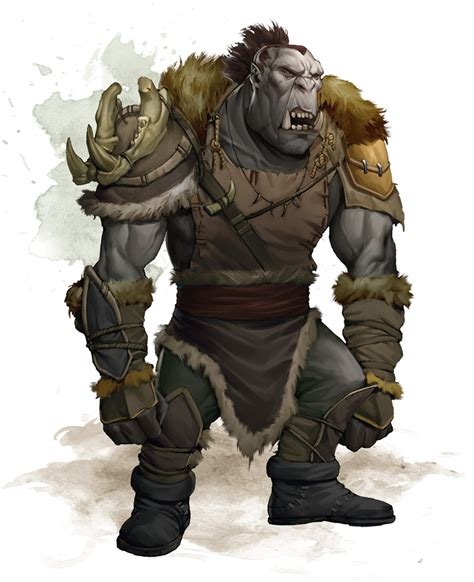

## Algemeen
* Soort: Tempel
* Inwoners: Geen
* Populatie: 0
* Geografische locatie: In de zijkant van de Sword Mountains
* Infrastructuur: Oude, gladde muren
* Politiek: -
* Geschiedenis: Ooit gebruikt als tempel door dwergen
* Cultuur: -

## Overzicht
Dazlyn Grayshard en Norbus Ironrune zijn schilddwerggoudzoekers en zakenpartners. Terwijl ze op zoek waren naar goud in de bergen ten zuidwesten van Phandalin, besloten ze een nabijgelegen kloof te verkennen en vonden ze bewijs van een oude dwergennederzetting begraven door een lawine. Ze zijn de afgelopen maanden bezig geweest met het opruimen van het puin en het doorzoeken van de ruïnes op zoek naar schatten, maar tot nu toe hebben ze niets van waarde gevonden.

Achter de nederzetting, uitgehouwen in de achterwand van de kloof, staat een oude tempel van Abbathor, de boze dwergen god van de hebzucht. Tijdens zonsverduisteringen wordt Abbathor tevredengesteld met offers van bloed en edelstenen. Bij één gelegenheid ontdekte de god dat de offers van de priesters van deze tempel ontbraken, dus veroorzaakte hij een aardbeving en lawine die delen van de tempel instortte en de nederzetting begroef. De priesters in de tempel die niet regelrecht werden gedood, werden omgevormd tot okerkleurige gelei - vernederde weerspiegelingen van Abbathor zijn honger en hebzucht.

De dwergenopgraving ligt pal ten oosten van Leilon, 24 kilometer ten zuidwesten van Phandalin, aan het oostelijke uiteinde van een kloof. De rotswanden van de kloof reiken tot een hoogte van twintig meter. Aan het einde van de kloof is een zes meter hoge muur van zwarte steen met een kapotte poort erin uitgehouwen, waarbij één stenen deur gevaarlijk aan een scharnier hangt en de andere deur ontbreekt. Voorbij deze open poort, in de schaduw van een grote berg in het oosten, ligt een verwoeste nederzetting.

---

## Komt voor in
* [De Draak van Icespire Peak]({{ site.baseurl }})

## Gerelateerde karakters
* [Dazlyn Grayshard]({{ site.baseurl }})
* [Norbus Ironrune]({{ site.baseurl }})

## Super-locaties
* -

## Sub-locaties
* -

## Locaties in de buurt
* [Phandalin]({{ site.baseurl }})

## Items
* -

## Galerij
<ul class="gallery">
    <li>
        <figure>
            

                
            

            <figcaption>Dwarven Excavation</figcaption>
        </figure>
    </li>
    <li>
        <figure>
            

                
            

            <figcaption>Dwarven Excavation Quest</figcaption>
        </figure>
    </li>
    <li>
        <figure>
            

                
            

            <figcaption>Ochre Jelly</figcaption>
        </figure>
    </li>
    <li>
        <figure>
            

                
            

            <figcaption>Orc</figcaption>
        </figure>
    </li>
</ul>