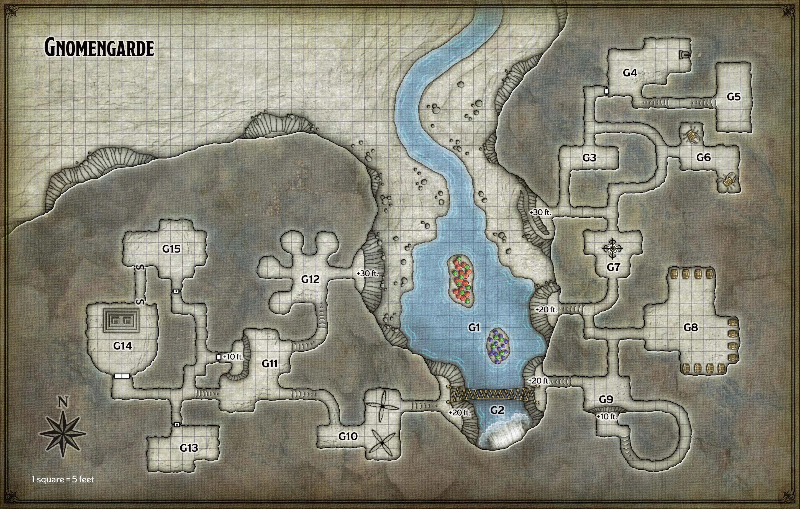
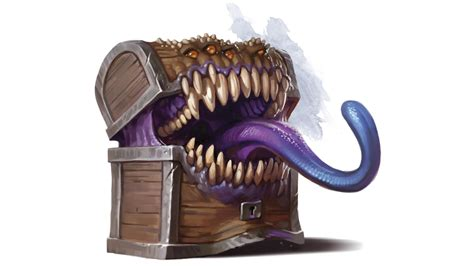

## Dungeon Master notities

### Statblocks

---

## Algemeen
* Soort: Grot
* Inwoners: Kabouters
* Populatie: 20
* Geografische locatie: In de Sword Mountains
* Infrastructuur: Ingegraven in de berg
* Politiek: Konings Korboz en Gnerkli hebben het voor het zeggen
* Geschiedenis: De kabouters zijn hier gaan wonen om de waterval dat een meer vormt aan de voet van de berg.
* Cultuur: Iedereen gaat goed met elkaar om

## Overzicht
Een stroom leidt bergopwaarts naar de voet van de berg, waar de erosie van de waterval een natuurlijke holte heeft uitgesleten. De brullende waterval creëert een mistwolk wanneer deze in een ondiepe waterplas stort, waarbinnen twee kleine eilandjes oprijzen die bedekt zijn met zestig centimeter hoge rode, groene en paarse paddenstoelen. Verschillende grotopeningen kijken uit op de poel vanaf rotsachtige richels, twintig tot tien meter boven de grond. De berg blokkeert het zonlicht om deze plek te bereiken.

Gnomengarde heeft vijf grotingangen bovenop richels met steile, rotsachtige hellingen. Een smal voetpad loopt omhoog langs de noordoostelijke helling, waardoor het gemakkelijk is om zonder controle naar de ingang van de grot te klimmen.

In Gnomengarde wonen twintig rots kabouters, waaronder koning Gnerkli en koning Korboz.

## Wilde magie
Wilde magie is een soort magie die niet onder controle kan worden gehouden, en Gnomengarde is daar al lang een bron van. Wanneer een wezen ergens op de Gnomengarde-kaart een spreuk uitvoert, kan er een bijkomend effect optreden.

## Locaties

### G1 Mistige beek en paddenstoel eilanden
De kabouters leven van 60 cm hoge paddenstoelen die groeien bovenop twee kleine eilanden in het midden van deze 90 cm diepe poel. De eilanden zijn voortdurend gehuld in mist van de waterval. De magie die door de eerste kolonisten van Gnomengarde aan de eilanden wordt verleend, zorgt ervoor dat de paddenstoelen abnormaal groot worden. Deze zelfde magie is de bron van de wilde magie van Gnomengarde (zie hierboven).

De paddenstoelen zijn er in drie kleuren. Rode paddenstoelen leveren olie die de kabouters gebruiken om hun lantaarns en andere mechanische apparaten van brandstof te voorzien. Groene paddenstoelen worden vermalen tot meel en gebruikt om een smakelijk groen brood te maken. Paarse paddenstoelen worden geplet en gefermenteerd om paddenstoelenwijn te maken, die net zo lekker smaakt als hij klinkt.

### G2. Waterval en touwbrug
De waterval stort zich 20 meter naar beneden, waarbij de mist een 10 meter lange touwbrug die stevig verankerd is aan 6 meter hoge richels lichtjes verduistert. De brug zakt zo door dat het middelpunt slechts 4,5 meter boven het water ligt.

### G3. Eetkamer
Deze kamer bevat verschillende eettafels en stoelen die geschikt zijn voor kleine mensen. Een stevige houten kast tegen de oostelijke muur bevat tinnen serviesgoed en bestek.

### G4. Keuken
Deze keuken is ingericht met het oog op kabouters, dus alles ligt dicht bij de vloer of is gemakkelijk bereikbaar door aan een te ingewikkeld touw-en-katrolmechanisme te trekken. Vijf rots kabouters zijn hier bezig:

* Joybell (vrouw) gebruikt een pook om het vuur aan te wakkeren van een hete ijzeren kachel die tegen de oostelijke muur staat.
* Dimble (man) gebruikt een ingewikkeld persachtig apparaat om olie uit een grote rode paddenstoel te persen en de vloeistof in vier olieflessen te filteren.
* Panana (vrouw) staat bovenop een lage tafel en gebruikt een mechanische deegroller om groen brooddeeg te kneden. Om haar heen liggen de afgehakte hoeden van verschillende grote groene paddenstoelen.
* Uppendown (man) vormt het deeg tot groene broden, waarbij hij zijn tong uitsteekt terwijl hij elk brood zorgvuldig vormt als een meester-beeldhouwer.
* Tervaround (vrouw) wankelt op een kruk terwijl ze een grote paarse paddenstoel in een vat propt, zodat deze kan gisten en er paddenstoelenwijn van kan worden gemaakt.

### G5. Bijkeuken
Deze kamer is hoog opgestapeld met kleine houten kratten. Elk bevat broden van groen champignonbrood en andere voedingsmiddelen die door de kabouters zijn verzameld en bewaard.

### G6. Vatkrabben
Geparkeerd in nissen in deze verder lege kamer staan twee gnomische constructies. Ze lijken allemaal op een krab met een ton als schelp, zes scharnierende metalen poten en een paar naar voren gerichte tangklauwen. Een luik aan de bovenkant van elke loop gaat open en onthult een binnen compartiment dat is uitgerust met een kleine, met leer beklede stoel omgeven door hendels, pedalen en versnellingen. De vaten zijn niet luchtdicht.

De kabouters bouwden deze krabachtige constructies om andere voorwerpen vast te pakken en te verplaatsen, een beetje zoals ruwe vorkheftrucks. De constructies zijn echter zo onhandig dat ze onbruikbaar zijn voor delicaat werk. Ze zijn net klein genoeg om door de 1,5 meter brede gangen van Gnomengarde te navigeren.

Elke vat krab is ontworpen om een enkele kleine mensachtige vast te houden, hoewel een middelgrote mensachtige er met enig ongemak in kan passen. Terwijl het wezen zich in de ton bevindt met het luik gesloten, heeft het volledige dekking tegen aanvallen van buiten het apparaat.

### G7. Automatisch ladend kruisboogplatform
Aan de vloer van deze kamer is een roterend platform vastgeschroefd, uitgerust met vier zware kruisbogen die automatisch herladen. Elke kruisboog wordt geleverd met twintig bouten. Boven de kruisbogen is op een hoogte van 1,80 meter een stoel gemonteerd die is uitgerust met pedalen die ervoor zorgen dat het hele apparaat tegen de klok in draait, en met hendels die de kruisbogen herladen en afvuren.

De uitvinder van het apparaat zit in de stoel, een kluizenaar van de rots kabouter genaamd Facktoré. Als ze vreemden ziet, besluit Facktoré het apparaat op hen uit te testen. Ze gaat pas staan als zij of haar apparaat niet meer functioneert, of als ze geen doelen meer kan zien. Omdat ze gestoord is en volledig in beslag wordt genomen door haar werk, kan ze nauwelijks een samenhangende zin aan elkaar rijgen, laat staan bezoekers adviseren waar ze heen moeten of met wie ze moeten praten.

### G8. Mimic en Champignonwijn
Deze kamer bevat twaalf vaten van veertig liter, geplaatst in brede nissen. Elk vat is beveiligd met een houten beugel. De vaten zijn afgetapt met houten tappen. Twee van die vaten zijn halfvol en twee zijn bijna leeg. Zeven van de acht vaten in de noordelijke en oostelijke alkoven zijn on-aangeboord en zitten vol paddenstoelwijn.

### G9. Kabouterwachtpost
Mist van de waterval dempt deze lege grot, die een 3 meter hoge rand heeft die erop uitkijkt in het zuiden. Op de rand staan twee rotskabouters: een vrouwtje genaamd Ulla en een mannetje genaamd Pog. Hun opdracht is om 'shapechangers ter plekke aan te vallen'. Omdat iedereen een shapechanger kan zijn, vallen ze iedereen aan die niet kan bewijzen dat hij is wie hij beweert te zijn.

### G10. Draaiende messen
Dit gebied wordt licht verduisterd door mist van de waterval. Het grotere oostelijke deel van de kamer bevat twee snel draaiende apparaten die eruit zien als tourniquets, uitgerust met stapels lange, scherpe messen op een afstand van 30 cm van elkaar. Het noordelijke tourniquet draait tegen de klok in, terwijl het zuidelijke met de klok mee draait.

In de zuidelijke muur van het kleinere westelijke deel van de kamer bevindt zich een koperen hendel in de neerwaartse positie. Als deze hendel omhoog wordt trekt, stoppen de tourniquets met draaien, waardoor een veilige doorgang door de kamer mogelijk is. De rotskabouters omzeilen deze val door de magiërshand te gebruiken om de hendel vanuit de oostelijke deuropening te verplaatsen.

### G11. Uitvindersworkshop
Een mannetje genaamd Fibblestib en een vrouwtje genaamd Dabbledob bevinden zich hier. Als de belangrijkste uitvinders van Gnomengarde proberen ze een uitvinding te bedenken die de waanzin van koning Korboz zal genezen. Het voorstel van Fibblestib is een ‘straal van gezond verstand’. Dabbledob vindt dat stom en wil in plaats daarvan iets bouwen dat een "dwangbuis" wordt genoemd.

Fibblestib en Dabbledob beschouwen het mysterie van de verdwijnende kabouters van ondergeschikt belang voor hun missie om hun koningen te helpen. Ze concentreren zich op Korboz en Gnerkli met uitsluiting van al het andere, en beloven magische beloningen in ruil voor hulp.

De werkplaats is volgestouwd met half voltooide gnomische uitvindingen die geen enkel doel dienen, en met werktafels bezaaid met ketellappergereedschap. Een 3 meter hoge richel kijkt uit over de kamer en is voorzien van een houten voetstuk waarop een in leer gebonden boek staat.

### G12. Kabouterwoonplaatsen
De vloer van deze grot is bezaaid met de overblijfselen van oude kampvuren. Vier zijgrotten dienen als slaapgedeelte, met in elke grot vijf kleine houten bedjes gepropt. Acht rotskabouters slapen hier heerlijk als de personages voor het eerst arriveren, met twee kabouters in elke zij grot: Caramip, Jabby, Nyx en Quippy (vrouwtjes), en Anverth, Delebean, Pallabar en Zook (mannetjes).

### G13. Schatkist
De deur van deze kamer is op slot en Fibblestib en Dabbledob (zie gebied G11) dragen de sleutels. De kamer bevat een wirwar van niet-functionele kabouters-gadgets, maar ook losse tandwielen, verwrongen stukjes metaal en andere restjes die de kabouters gebruiken om nieuwe uitvindingen in elkaar te zetten.

Te midden van de rommel kunnen de zijn een Clockwork Amulet en een Pole of Collapsing te vinden.

### G14. Troonzaal
Bovenop een stenen podium staan twee gedrongen tronen gemaakt van schroot en op maat gemaakt voor kabouters. Een geheime deur in de noordelijke muur verbergt een korte tunnel die naar gebied G15 leidt. Alleen de kabouterkoningen kennen deze geheime doorgang.

### G15. De slaapkamer van Kabouterkoningen
Koning Korboz heeft zichzelf en koning Gnerkli opgesloten in hun slaapkamer, waarbij hij vergeet dat er een geheime deur is die anderen kunnen vinden en gebruiken om toegang te krijgen. Alleen Korboz en Gnerkli hebben sleutels van de afgesloten hoofddeur. Als de personages op de deur kloppen of op een andere manier hun aankomst aankondigen, spreekt Korboz met hen vanuit de kamer en waarschuwt voor een "vormwisselaar" in hun midden. Korboz komt pas weer bij zinnen als de personages hem verzekeren dat het monster is gevonden en gedood. Of de nabootser nu echt vermoord is of niet, het overtuigen van Korboz ervan dat hij dood is, vereist een succesvolle DC 12 Charisma (Persuasion) -controle.

Korboz en Gnerkli zijn kluizenaars van rotskabouters, elk met een grillige metalen kroon en een patchwork-mantel. Gnerkli wordt vastgelijmd aan een stoel en vastgehouden. Korboz heeft een fles met oplosmiddel bij zich die de lijm bij contact oplost. Hun kamer bevat alle attributen van een mooi ingerichte kabouterslaapkamer.

Een kleine, niet-afgesloten kist onder het bed van de kabouters bevat een Hat of Wizardry en een volledig opgeladen Wand of Pyrotechnics.

---

## Komt voor in
* [Dragon of Icespire Peak]({{ site.baseurl }})

## Gerelateerde karakters
* Anverth
* Caramip
* Dabbledob
* Delebean
* Dimble
* Facktoré
* Fibblestib
* Gnerkli
* Jabby
* Joybell
* Korboz
* Nyx
* Pallabar
* Panana
* Pog
* Quippy
* Tervaround
* Ulla
* Uppendown
* Zook

## Super-locaties
* Sword Mountains

## Sub-locaties
* -

## Locaties in de buurt
* Axeholm
* [Dwarven Excavation]({{ site.baseurl }})
* Icespire Hold
* Icespire Peak
* Mountain's Toe Gold Mine
* [Phandalin]({{ site.baseurl }})
* [Umbrage Hill]({{ site.baseurl }})

## Items
* [Clockwork Amulet]({{ site.baseurl }})
* [Hat of Wizardry]({{ site.baseurl }})
* [Pole of Collapsing]({{ site.baseurl }})
* [Wand of Pyrotechnics]({{ site.baseurl }})

## Galerij

