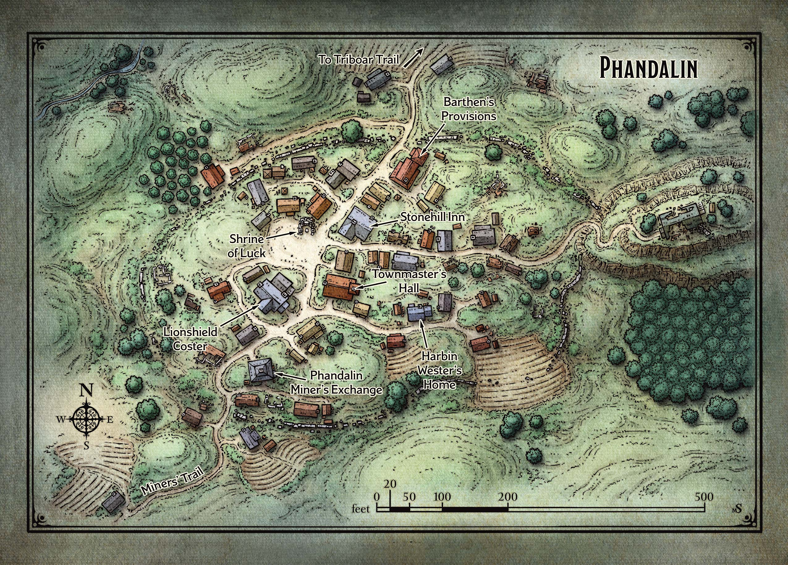

## Dungeon master notities

### Phandalin verhalen

De verschillende NPC's in Phandalin horen wel eens geruchten. Als de spelers hierom vragen, rol dan een d6 op onderstaande tabel om te kijken welk verhaal de NPC verteld. Als de spelers dit verhaal al hebben gehoord, vertel dan niks, rol opnieuw, of vertel een verhaal die ze nog niet gehoord hebben.

|  d6  |  Verhaal  |
| ---- | --------- |
|  1   | "Wederom zijn de Orcs uit de bergen gekomen om op de laaglanden te jagen! Als Neverwinter niet snel hulp stuurt, zullen de Orcs Phandalin overrompelen en alles vernietigen waar we zo hard aan hebben gewerkt om het weer op te bouwen."|
| 2  | "De Triboar Trail loopt naar het oosten, door de ruïnes van Conyberry, een stad die jaren geleden door barbaren is geplunderd. Er is een verwoeste tempel ten zuiden van Conyberry, men zegt dat de lokale bevolking daar hun goud heeft verborgen.' (Als de personages de tempel bezoeken, zie "Shrine of Savras" op pagina 38.)" |
| 3  | "Vreemde magie doordringt Neverwinter Wood, brengt zeevaarders in verwarring en verdoezelt de oude ruïnes van vervlogen koninkrijken die in de diepte verloren zijn gegaan." |
| 4  | "Falcon's Hunting Lodge is de enige veilige haven in Neverwinter Wood. Het ligt diep in het bos langs de rand van een rivier, en rijke edelen wagen zich daar om te jagen terwijl ze onder Falcon's bescherming staan. Falcon is een gepensioneerde veteraan van vele oorlogen, en er wordt gezegd dat hij gratis verblijf zal aanbieden aan iedereen die hem een fles wijn brengt." (Als de personages Falcon bezoeken, zie dan "Falcon's Hunting Lodge" op pagina 24.)|
| 5  | "Ten westen van Phandalin, aan de kust, staat een oude stenen vuurtoren. Schepen worden naar deze glanzende toren getrokken als motten naar een vlam, en zijn gedoemd op de rotsen neer te storten. Hun wrakken moeten gevuld zijn met schatten!" (Als de personages de vuurtoren bezoeken, zie "Tower of Storms" op pagina 40.) |
| 6  | "Sommige mensen beweren een draak door de hoge wolken te hebben zien vliegen. Op die afstand is het moeilijk om de grootte van het wezen in te schatten, maar sommigen zeggen dat het zo groot is als een olifant en glanzende witte schubben heeft." |

---

## Algemeen
* Soort: Dorp
* Inwoners: Diverse rassen, vooral mensen
* Populatie: 50-200
* Geografische locatie: Aan de voet van de Sword Mountains
* Infrastructuur: Zo'n 40 tot 50 houten gebouwen
* Politiek: Harbin Wester is de gemeentemeester
* Geschiedenis: Aantal jaren geleden wederopgebouwd uit de ruïnes van de grote, rijke stad dat het ooit was
* Cultuur: Nauwe samenleving, bezoekers zijn welkom

## Overzicht
Genesteld in de rotsachtige heuvels aan de voet van de met sneeuw bedekte Sword Mountains ligt het mijnstadje Phandalin, dat bestaat uit veertig tot vijftig eenvoudige houten gebouwen. Afbrokkelende stenen ruïnes omringen de nieuwere huizen en winkels en laten zien hoe dit in de afgelopen eeuwen een veel grotere stad moet zijn geweest.

De inwoners van Phandalin zijn rustige, hardwerkende mensen die uit verre steden kwamen om een leven op te bouwen in de barre wildernis. Het zijn boeren, steenhouwers, smeden, handelaars, goudzoekers en kinderen. De stad heeft geen muren en geen garnizoen, maar de meeste volwassenen houden wapens binnen handbereik voor het geval de behoefte aan wapens zich mocht voordoen.

Bezoekers zijn hier welkom, vooral als ze goud te besteden hebben of nieuws te delen. De Stonehill Herberg in het centrum van de stad biedt bescheiden accommodatie en maaltijden. Een paar deuren verder van de herberg, buiten de hal van de stadmeester, is een vacaturebord voor avonturiers.

## Stonehill Herberg
In dit bescheiden wegrestaurant van twee verdiepingen zijn op de bovenverdieping zes kamers te huur. Een bed voor de nacht kost 5 sp, terwijl een maaltijd 1 sp kost. De eigenaar is een vriendelijke mannelijke mens genaamd Hugo Staalzwaard. Hugo is een inwoner van de stad Triboar in het oosten. Hij kwam naar Phandalin om te prospecteren, maar besefte al snel dat hij veel meer wist over het runnen van een herberg dan over de mijnbouw.

## Barthen's Voorzieningen
In de schappen van deze winkel liggen de meeste gewone goederen en benodigdheden, waaronder rugzakken, slaaprollen, touw en rantsoenen. Barthen's heeft geen wapens of bepantsering op voorraad, maar je kunt hier andere avonturenuitrusting kopen, met uitzondering van items die meer dan 25 gp kosten. Degenen die wapens of bepantsering nodig hebben, worden doorverwezen naar de Lionshield Coster. Degenen die genezingsdrankjes willen kopen, worden verzocht om Adabra Gwynn op Umbrage Hill te bezoeken.

De eigenaar, Elmar Barthen, is een magere en kalende menselijke man van vijftig jaar. Hij heeft een paar jonge klerken in dienst (Ander en Thistle) die helpen bij het laden en lossen van wagons, en die op klanten wachten als Barthen er niet is.

## Lionshield Coster
Boven de voordeur van deze bescheiden handelspost hangt een bord in de vorm van een houten schild met daarop een blauwe leeuw geschilderd.

Dit gebouw is eigendom van de Lionshields, een koopmansbedrijf gevestigd in de stad Yartar, ruim honderd kilometer naar het oosten. Het bedrijf verzendt eindproducten naar Phandalin en andere kleine nederzettingen in de regio.

De meester van de Phandalin-post is een menselijke vrouw van vijfendertig met scherpe tong, genaamd Linene Graywind. Linene heeft een voorraad pantsers en wapens, die allemaal te koop zijn aan geïnteresseerde kopers. Linene zal geen wapens verkopen aan iemand van wie zij denkt dat deze een bedreiging voor de stad kan vormen.

## Phandalin Mijnwerkersbeurs
Mijnwerkers komen hier om hun waardevolle vondsten te laten wegen, meten en uitbetalen. De beurs fungeert ook als een onofficieel archiefkantoor, waar claims op verschillende stromen en opgravingen in de omgeving worden geregistreerd. Er is voldoende rijkdom verborgen in de nabijgelegen beken en valleien om een groot aantal onafhankelijke goudzoekers te ondersteunen.

De mijnwerkersbeurs is een geweldige plek om mensen te ontmoeten die veel tijd doorbrengen op het platteland rond Phandalin. De gildemeester is een berekenende menselijke vrouw genaamd Halia Thornton.

## Heiligdom van Geluk
De enige tempel van Phandalin is een heiligdom gemaakt van stenen uit de nabijgelegen ruïnes. Het is opgedragen aan Tymora (godin van geluk) en wordt normaal gesproken beheerd door een ijverige elf acoliet genaamd Sister Garaele. Ze is echter de stad uit voor onbepaalde duur. Sister Garaele brengt regelmatig verslag uit aan haar superieuren over de gebeurtenissen in en rond Phandalin, en is momenteel in Neverwinter om precies dat te doen. Bij haar afwezigheid blijft het heiligdom onbeheerd achter.

## Stadhuis
De hal van de stadmeester heeft stevige stenen muren, een schuin houten dak en een klokkentoren aan de achterkant. Op het vacaturebord naast de voordeur staan een beperkt aantal mededelingen, allemaal geschreven in Common en in hetzelfde handschrift.

Alle aankondigingen op de vacaturebank zijn geschreven door Harbin Wester, de door Phandalin aangewezen gemeentemeester. Harbin is een pompeuze bankier van middelbare leeftijd die in een huis ten oosten van het stadhuis woont. Berichten over een witte draak in het gebied hebben hem tot een ware opsluiting gemaakt, en hij gaat zelden naar buiten, behalve om eten te halen en nieuwe mededelingen te plaatsen waarin hij avonturiers oproept.

Personen die bij Harbin aankloppen, horen zijn stem aan de andere kant zeggen: "Als je een draak bent, weet dan dat ik veel te mager en benig ben om een goede maaltijd te bereiden!" Wat de avonturiers ook doen om zijn angsten weg te nemen, Harbin weigert de deur te openen en praat er liever doorheen. Andere bewoners die Harbin met klachten lastigvallen, krijgen een soortgelijke behandeling.

Als avonturiers hem naar een zoektocht vragen, zet Harbin ze op het goede spoor en biedt hij betaling aan bij hun terugkeer. Als het tijd is om te betalen, schuift hij de betaling één gouden munt tegelijk onder de deur.

---

## Komt voor in
* [Dragon of Icepire Peak]({{ site.baseurl }})

## Gerelateerde karakters
* [Ander]({{ site.baseurl }})
* [Elmar Barthen]({{ site.baseurl }})
* [Halia Thornton]({{ site.baseurl }})
* [Harbin Wester]({{ site.baseurl }})
* [Hugo Staalzwaard]({{ site.baseurl }})
* [Linene Graywind]({{ site.baseurl }})
* [Sister Garaele]({{ site.baseurl }})
* [Thistle]({{ site.baseurl }})

## Super-locaties
* Sword Mountains

## Sub-locaties
* -

## Locaties in de buurt
* Axeholm
* [Dwarven Excavation]({{ site.baseurl }})
* [Gnomengarde]({{ site.baseurl }})
* Icepire Hold
* Icepire Peak
* Mountain's Toe Gold Mine
* [Umbrage Hill]({{ site.baseurl }})

## Items
* -

## Galerij

