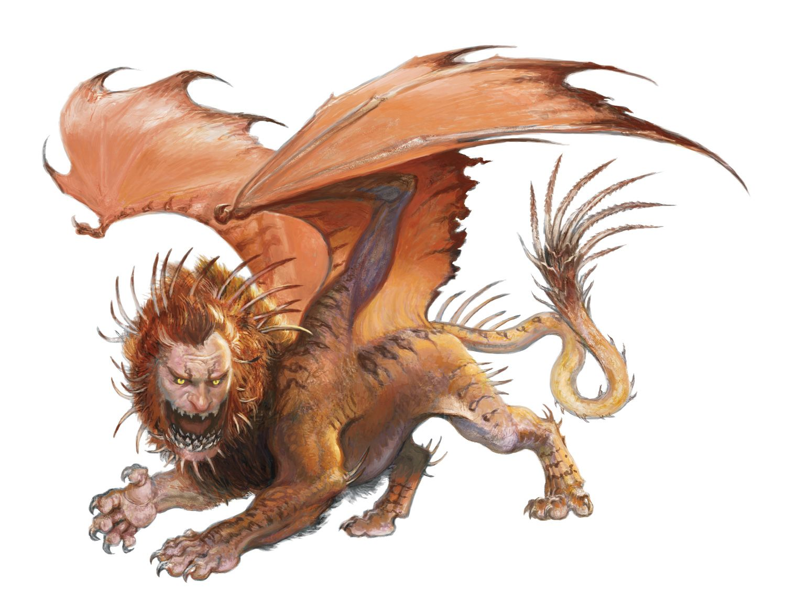

## Algemeen
* Soort: Heuvel
* Inwoners: Adabra Gwynn
* Populatie: 1
* Geografische locatie: Aan de voet van de Sword Mountains
* Infrastructuur: Een enkele 100 jaar oude windmolen
* Politiek: -
* Geschiedenis: Oud slagveld
* Cultuur: Adabra heeft niet graag bezoekers

## Overzicht
Umbrage Hill kreeg zijn naam nadat twee ruziënde dwergclans er bovenop een veldslag hadden uitgevochten. De oorzaak van hun aanstoot is een verhaal dat verloren is gegaan door de tijd, en alleen de steenmannetjes van de doden zijn er nog over. De stenen windmolen op de heuvel is een latere toevoeging, maar nog steeds ruim honderd jaar oud.

Adabra Gwynn, een vroedvrouw en apotheker gewijd aan Chauntea (godin van de landbouw), woont hier. Adabra weigert terug te keren naar Phandalin, ook al loopt ze gevaar.

Adabra verkoopt Potions of Healing voor 50 gp.

---

## Komt voor in
* [Dragon of Icespire Peak]({{ site.baseurl }})

## Gerelateerde karakters
* [Adabra Gwynn]({{ site.baseurl }})

## Super-locaties
* Sword Mountains

## Sub-locaties
* -

## Locaties in de buurt
* Axeholm
* [Dwarven Excavation]({{ site.baseurl }})
* [Gnomengarde]({{ site.baseurl }})
* Icespire Hold
* Icespire Peak
* Mountain's Toe Gold Mine
* [Phandalin]({{ site.baseurl }})

## Items
* -

## Galerij

