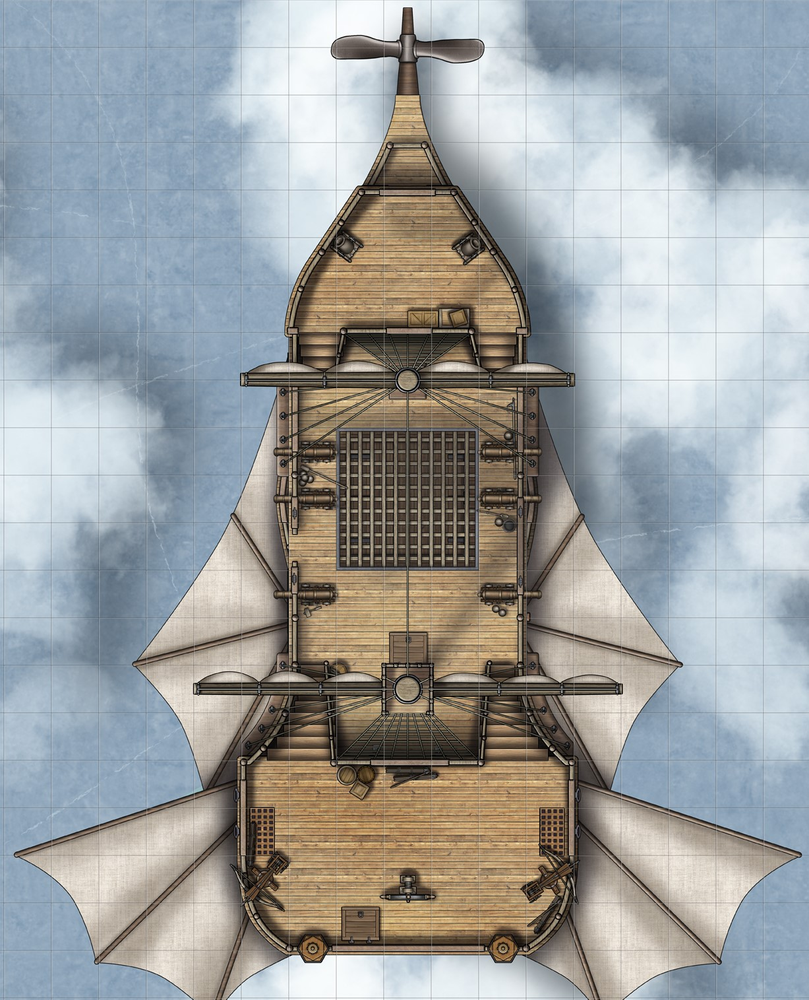

## Algemeen
* Soort: Luchtschip
* Inwoners: Diverse rassen aan zeelieden
* Populatie: Ongeveer 10
* Geografische locatie: Wisselend, vaak in de lucht van Greenguard
* Infrastructuur: Houten romp en hennepvezel zeilen 
* Politiek: Kapitein Groenbaard is de baas, maar hij luistert graag naar zijn bemanning
* Geschiedenis: Diende als luchtschip voor het koninkrijk van Greenguard. Nog niet zo lang geleden gestolen door Kapitein Groenbaard en zijn bemanning
* Cultuur: Draag je eigen steentje bij en wordt naar rato beloond

## Overzicht
Het schip van Kapitein Groenbaard lijkt erg op de schepen van de koninklijke luchtmacht van Greenguard. Sterker nog, het is één van de schepen van het rijk. Groenbaard heeft het schip samen met zijn bemanning weten kapen door een goed gecoördineerde aanval te plegen in een licht-bemande luchthaven. De vlaggen van het schip zijn vervangen zodat het minder duidelijk is dat dit een gestolen schip is, maar een goed oog kan de overeenkomsten wel zien.

## Dek
Op het dek van het schip zijn de wapens en het roer te vinden. Aan elke kant staan drie kanonnen en één ballista. Het roer bevindt zich op een verhoogd platform op de achtersteven. Onder het roer bevindt zich de kamer van de kapitein. Aan de boeg is een trap te vinden die naar beneden toe leidt.

## Ruim - midden
In het midden van het schip bevindt zich een eetruimte met keuken, een opslagruimte, en een paar kamers voor de bemanning. Er zijn raampjes aan de zijkanten van het schip. Er is één trap die naar boven leidt, en twee die naar beneden leiden.

## Ruim - onder
Onderin het schip bevindt zich een grote opslagruimte, twee kamers voor bemanning of gevangenen, de magische motor van het schip, en de toiletten. De motor van het schip zorgt er op een magische manier voor dat het schip kan vliegen. Als deze motor beschadigd wordt zal het schip neerstorten.

---

## Komt voor in
* [Captain Greenbeard's Legend]({{ site.baseurl }})

## Gerelateerde karakters
* [Gareth Bloodwood]({{ site.baseurl }})
* [Gaston de Kok]({{ site.baseurl }})
* [Kapitein Groenbaard]({{ site.baseurl }})

## Super-locaties
* [Zandzee]({{ site.baseurl }})

## Sub-locaties
* -

## Locaties in de buurt
* [Tempel van ^.^]({{ site.baseurl }})

## Items
* -

## Galerij

