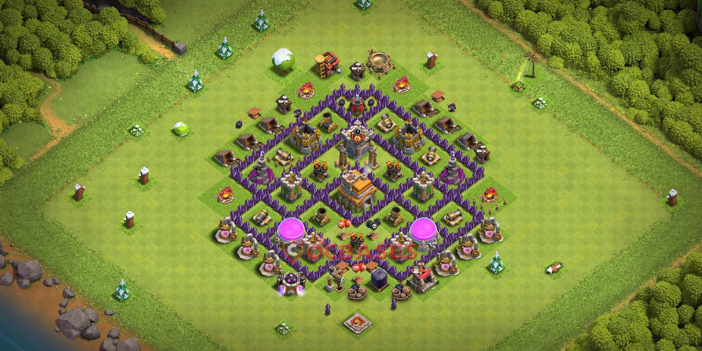

## Algemeen
* Soort: Dorp
* Inwoners: Dorpelingen en gevechtstroepen
* Populatie: Ongeveer 500
* Geografische locatie: Een vruchtbare vallei omgeven door heuvels en dichte bossen
* Infrastructuur: Centrale plein, woongebied, ambachtswijk, barakken, verdedigingstorens, hulpbronnengebouwen
* Politiek: Geleid door de dorpsleider, Eldric de Wijze, met een raad van oudere inwoners
* Geschiedenis: Oorspronkelijk gesticht als een klein landbouwdorp, maar uitgegroeid tot een strategische nederzetting door constante verdediging tegen plunderaars
* Cultuur: Gemeenschapsgeest, handel, militair gedisciplineerd, bekend om ambachtelijke vaardigheden en kwalitatieve goederen

## Overzicht
Grijssteen is een levendig dorp met een sterke gemeenschapszin. Het dorp staat bekend om zijn strategische ligging en robuuste verdedigingen. De inwoners werken samen om hun huizen en middelen te beschermen tegen aanvallen van rivaliserende clans.

### Centraal Plein
Het centrale plein is het bruisende hart van Grijssteen. Hier komen de inwoners samen voor markten, dorpsvergaderingen en feestelijkheden. Het plein is versierd met marktkraampjes en een groot standbeeld ter ere van voormalige helden.

### Woongebied
In dit deel van het dorp bevinden zich de huizen van de inwoners. De woningen zijn goed onderhouden en weerspiegelen de welvaart van de gemeenschap. De nauwe straten en paden geven een gevoel van gezelligheid en verbondenheid.

### Ambachtswijk
De ambachtswijk herbergt de werkplaatsen van smeden, timmerlieden en andere vaklieden. De lucht is gevuld met het geluid van hamers op aambeelden en de geur van vers hout. Hier kunnen spelers uitrusting en modificaties voor hun uitrusting vinden.

### Barakken en Trainingsgronden
De barakken bevinden zich aan de rand van het dorp en dienen als huisvesting en trainingsfaciliteiten voor de dorpssoldaten. De trainingsgronden zijn uitgerust met oefenpoppen, sparring-ringen en boogschietdoelen. Onder leiding van Kara de Felle worden de troepen dagelijks gedrild en voorbereid op verdediging en aanvallen.

### Hulpbronnen Gebouwen
De regio aan de rand van het dorp bevat de essentiële gebouwen voor de economische stabiliteit van Grijssteen, waaronder goudmijnen, elixirverzamelaars, en donkere elixirboren.

### Verdedigingsstructuren
Verspreid door het dorp bevinden zich belangrijkste verdedigingsmechanismen, zoals kanonnen, boogschutterstorens, en tovenaarstorens.

### Genezers Kwartier
In dit gebied woont Liora de Zachte, samen met andere genezers en tovenaars. Het bevat een geneescentrum en een magische drankjesfabriek. In de drankjesfabriek worden drankjes zoals Healing Spell, Rage Spell, en Earthquake Spell gemaakt om te gebruiken in strijd met andere stammen.

---

## Komt voor in
* [Conflict van Stammen]({{ site.baseurl }})

## Gerelateerde karakters
* Eldric de Wijze
* Kara de Felle
* Liora de Zachte

## Super-locaties
* -

## Sub-locaties
* -

## Locaties in de buurt
* [IJzerfort]({{ site.baseurl }})

## Items
* Healing Spell
* Rage Spell
* Earthquake Spell

## Galerij

