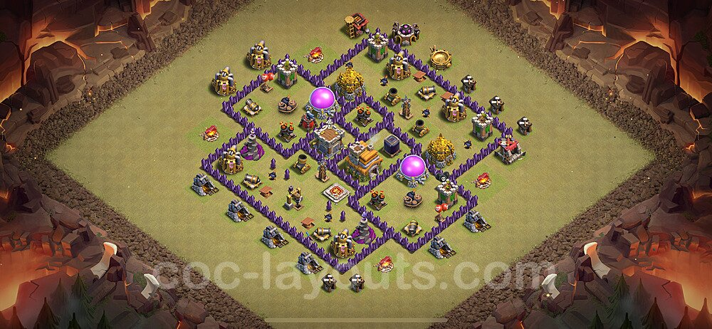

## Algemeen
* Soort: Dorp
* Inwoners: Dorpelingen en gevechtstroepen
* Populatie: Ongeveer 500
* Geografische locatie: Diep in een oud, dicht bos
* Infrastructuur: Kristallen muren, versterkte poorten, defensieve structuren, centrale plein, woongebied, barakken, hulpbronnengebouwen
* Politiek: Geleid door Thorn de Veroveraar, met een hiërarchie van militair leiderschap
* Geschiedenis: Oorspronkelijk een kleine nederzetting, gegroeid door agressieve uitbreidingen en plunderingen van naburige dorpen
* Cultuur: Militaire discipline, kracht en strategie, focus op expansie en verdediging

## Overzicht
IJzerfort is een streng gecontroleerd dorp met een cultuur die draait om militaire discipline en strategische verovering. De inwoners zijn goed getraind en altijd paraat om hun thuis te verdedigen en uit te breiden door middel van plunderingen en aanvallen.

## Perimeter Muren
De hoge kristallen muren, versterkt met metalen platen en spikes, omringen IJzerfort en bieden een stevige verdediging tegen aanvallers. Bewaakte wachttorens bevinden zich op regelmatige afstanden langs de muur.

## Poorthuizen
IJzerfort heeft meerdere zwaar versterkte poorten, elk met een valhek en een garnizoen van bewakers. Deze poorten vormen de enige legale toegangswegen tot het dorp en zijn extreem goed verdedigd.

## Centraal Plein
Het centrale plein van IJzerfort dient als verzamelplaats voor troepen en publieke bijeenkomsten. Omringd door belangrijke gebouwen, is dit plein vaak vol militaire activiteit en toezicht.

## Woongebied
De woningen van de inwoners en soldaten van IJzerfort zijn gegroepeerd in compacte clusters voor betere bescherming. Dit gebied straalt een sfeer van discipline en orde uit, met weinig ruimte voor persoonlijkheid en versiering.

## Barakken en Trainingsgronden
De barakken en trainingsgronden zijn altijd druk bezig met de training en voorbereiding van de troepen onder leiding van Ragnar de Meedogenloze. Oefenpoppen, sparring-ringen en boogschietdoelen zijn hier alomtegenwoordig.

## Hulpbronnen Gebouwen
Deze regio is essentieel voor de economische stabiliteit van IJzerfort:
- **Goudmijnen**: Goed bewaakt, strategisch gelegen aan de rand van het dorp.
- **Elixirverzamelaars**: Magische apparaten die elixir uit de grond trekken, gelegen nabij het dorpscentrum.
- **Donkere Elixirboren**: Zeldzame en zwaar beveiligde boorinstallaties voor het winnen van donkere elixir.

## Verdedigingsstructuren
IJzerfort heeft meerdere lagen van verdediging om elke aanval af te slaan:
- **Kannonen**: Geplaatst om de belangrijkste toegangswegen te bestrijken en klaar om verwoestend vuur te openen.
- **Boogschuttertorens**: Hoge torens die een uitstekend uitzicht bieden voor boogschutters om pijlen te regenen op indringers.
- **Tovenaartorens**: Magische torens bemand door krachtige tovenaars die vernietigende spreuken kunnen uitspreken.
- **Verborgen Tesla Coils**: Verborgen defensieve structuren die krachtige elektrische schokken afgeven aan nietsvermoedende indringers.
- **Verschillende Valstrikken**: Springvallen, bommen en reuzenbommen strategisch geplaatst om aanvallers te verrassen en te verwonden.

---

## Komt voor in
* [Conflict van Stammen]({{ site.baseurl }})

## Gerelateerde karakters
* Thorn de Veroveraar
* Ragnar de Meedogenloze
* Elena de Snelle

## Super-locaties
* -

## Sub-locaties
* -

## Locaties in de buurt
* [Grijssteen]({{ site.baseurl }})

## Items
* -

## Galerij

